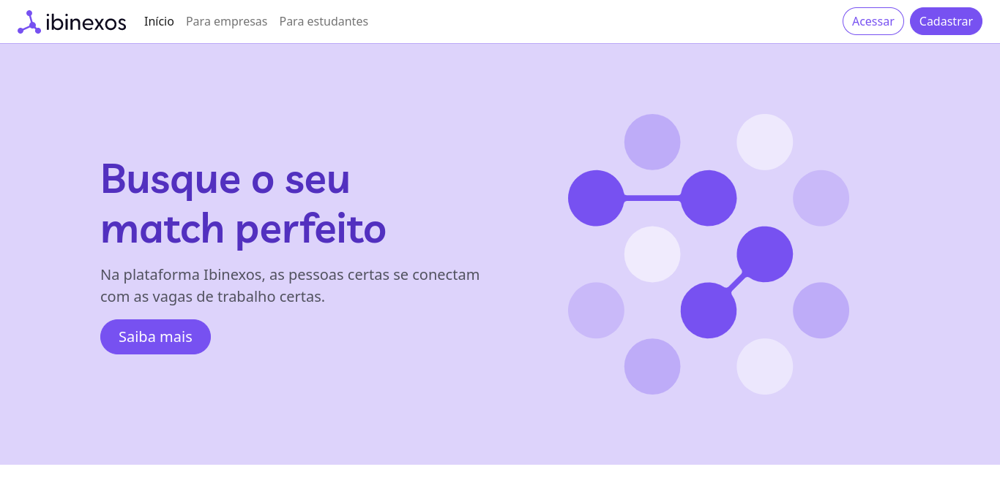

# Projeto de front-end da Ibinexos

Projeto front-end da plataforma Ibinexos, com base no framework Bootstrap 5.

[](https://app.netlify.com/sites/ibinexos/deploys)

## Índice

<!--ts-->
- [Tecnologias](#tecnologias)
- [Pré-requisitos](#pré-requisitos)
- [Instalação](#instalação)
- [Como usar](#como-usar)
- [Screenshots](#screenshots)
- [Status](#status)
- [Contribuição](#contribuição)
- [Autor](#autor)
- [Licença](#licença)
<!--te-->

## Tecnologias
    
As seguintes ferramentas foram usadas na construção do projeto:

- [Bootstrap](https://getbootstrap.com/) (v5.2)
- [Node.js](https://nodejs.org/en/)
- [Parcel](https://parceljs.org/)

## Pré-requisitos

Antes de começar, você precisará ter as seguintes ferramentas instaladas em sua máquina:

- [Git](https://git-scm.com)
- [Node.js](https://nodejs.org/en/)
- [VS Code](https://code.visualstudio.com/) (recomendado)

## Instalação

No diretório do projeto, você pode executar:

```
npm install
```

## Como usar

Para executar o app, no diretório do projeto, você pode executar:

```
npm run dev
```
Inicie o app no modo de desenvolvimento. Abra [http://localhost:1234](http://localhost:1234) para visualizá-lo em seu navegador.


## Screenshots



## Status

Em produção

## Contribuição

Pull requests não estão sendo aceitos no momento.

## Autor

Desenvolvido por [Danilo S.](https://www.linkedin.com/in/danilocdesousa/)

## Licença

[ISC](https://choosealicense.com/licenses/isc/)
